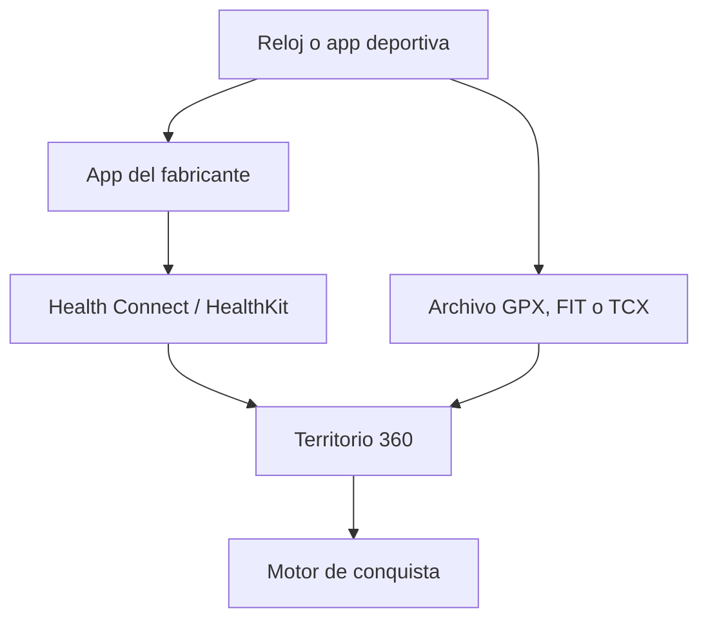

# Territorio 360 — diseño de producto

## La idea central

Territorio 360 convierte salir a hacer deporte en descubrir y colorear el mundo. Cada actividad deja una huella visible por modalidad, permite ampliar un mapa personal permanente y aporta puntos a competiciones cercanas.

No intenta sustituir al reloj ni a la aplicación deportiva habitual. Recibe el recorrido GPS, aplica las reglas de conquista y añade la capa social y de juego.

## Reglas de conquista

| Situación | Resultado | Qué suma distancia | Qué suma conquista |
|---|---|---|---|
| Ruta cerrada de 500 m o más y final a 100 m o menos del inicio | Polígono siguiendo el recorrido real | Toda la ruta | Solo superficie interior todavía no conquistada |
| Ruta abierta | Corredor lineal siguiendo el recorrido real | Toda la ruta | Solo tramos todavía no conquistados |
| Ruta repetida | La huella sigue visible en el historial | Todos los kilómetros | Nada en la parte ya conquistada |
| Natación en aguas abiertas con GPS | Zona o línea según el recorrido | Toda la distancia | Territorio nuevo |
| Natación en piscina sin ruta GPS | Actividad sin territorio | Toda la distancia | No conquista mapa |

Cada modalidad tiene un color reconocible. El mapa debe permitir activar o desactivar correr, caminar, bicicleta y natación para entender cómo se conquistó cada lugar.

## Dos mapas que evitan frustración

1. **Mapa personal permanente.** Nunca se pierde. Enseña todo lo que la persona ha explorado desde que empezó.
2. **Mapa competitivo de temporada.** Se reinicia por temporadas y permite disputar zonas sin borrar el progreso personal.

Así una persona nueva puede competir y una persona veterana conserva su historia. Una zona competitiva cambia de control mediante actividad válida reciente y puntos de conquista, no por una única salida imposible de superar.

## Comunidad y motivación

- **Personas que sigo:** capa opcional en el mapa y feed de nuevas conquistas, sin mostrar ubicaciones en directo.
- **Clasificación de ciudad:** kilómetros totales y puntos de conquista durante semana, mes y temporada.
- **Clasificación de seguidos:** los mismos dos indicadores, para grupos pequeños.
- **Exploración cercana:** niebla del mapa, barrios incompletos y sugerencias de rutas que conectan huecos.
- **Misiones:** cerrar una zona, unir dos territorios, probar otra modalidad o descubrir un punto cercano.
- **Expediciones de equipo:** colaborar para completar parques, caminos verdes o costas durante un fin de semana.
- **Rachas saludables:** cuentan días activos con descanso protegido; no penalizan una recuperación necesaria.
- **Celebraciones útiles:** resumen visual al finalizar con kilómetros, área o línea nueva y posición local actualizada.

## Clasificaciones justas

La clasificación siempre muestra claramente el ámbito y el periodo:

- Ámbito: ciudad, personas seguidas, equipo o global.
- Métrica: kilómetros o conquista.
- Periodo: semana, mes, temporada o histórico.
- Modalidad: todas, correr, caminar, bicicleta o natación.

Los kilómetros repetidos cuentan en distancia. La conquista solo aumenta con superficie o tramos nuevos. La puntuación usa multiplicadores por modalidad para que la bicicleta no domine por velocidad y la natación en aguas abiertas siga siendo valiosa.

## Relojes y aplicaciones

Orden recomendado de integración:

1. GPX y TCX, ya disponibles para Suunto, COROS, Garmin, Polar, Wahoo y otras marcas.
2. Health Connect en Android para sesiones de correr, caminar, bicicleta y natación. Las rutas creadas por otras apps requieren consentimiento explícito del usuario.
3. HealthKit en iPhone y Apple Watch.
4. Conectores directos con COROS, Suunto, Strava, Garmin y otros cuando exista backend, credenciales de proveedor y aprobación de sus procesos de acceso.

Cada actividad importada debe guardar el proveedor y el identificador externo para impedir duplicados.

## Privacidad y juego limpio

- Ocultar automáticamente los primeros y últimos 200 m cerca de lugares sensibles en vistas sociales.
- Nunca compartir ubicación en directo; publicar una actividad solo cuando haya finalizado.
- Permitir que cada actividad sea privada, de seguidores o pública.
- Calcular la ciudad o zona de ranking en el servidor sin publicar el domicilio ni el punto de salida.
- Filtrar saltos GPS, velocidades incompatibles con la modalidad y recorridos con mala precisión.
- Marcar una actividad dudosa como pendiente: conserva el historial privado, pero no altera territorio social ni rankings hasta validarse.
- No permitir que una actividad importada varias veces vuelva a sumar.

## Fases

| Fase | Entrega |
|---|---|
| 0.2 | GPS, GPX, cuatro deportes, circuitos y líneas, mapa personal, dos métricas locales |
| 0.3 | GPX y TCX multimarca, detección de origen y prevención de duplicados |
| 0.4 beta | Cuentas, grupo privado, feed, mapa opt-in y dos rankings compartidos |
| 0.5 | Health Connect, selector de actividades y sincronización fiable en segundo plano |
| 0.6 | Seguidores, privacidad automática y rankings por ciudad |
| 0.7 | Temporadas, equipos, rutas sugeridas, misiones compartidas y protección antifraude avanzada |

## Mejoras priorizadas

1. **Conexión automática y fiable.** Health Connect primero; después APIs directas de fabricantes con OAuth y un identificador único por actividad.
2. **Mapa social controlable.** Capas separadas para mi territorio, personas seguidas y temporada local, con colores legibles y filtros por deporte.
3. **Ligas cercanas.** Clasificaciones semanales y mensuales de ciudad, seguidos y equipos, siempre separando kilómetros de conquista.
4. **Rutas hacia terreno nuevo.** Proponer recorridos seguros que pasen por huecos sin explorar y permitir elegir distancia y modalidad.
5. **Retos cooperativos.** Conquistar entre varias personas un parque, una vía verde o un conjunto de barrios.
6. **Privacidad y juego limpio.** Ocultar domicilio, no publicar en directo, detectar saltos GPS y dejar actividades dudosas fuera del ranking.
7. **Motivación saludable.** Rachas con días de descanso, objetivos personales y recompensas por constancia, no por entrenar de forma excesiva.
8. **Resumen visual.** Animación del recorrido al terminar, porcentaje nuevo, insignias y posición local antes/después.

## Indicador principal de éxito

La métrica principal no debe ser el tiempo dentro de la aplicación, sino cuántas personas vuelven a salir y completan una actividad saludable otra semana. El juego debe motivar movimiento sostenible, exploración y relación local, no sobreentrenamiento.
